# Graphical Password Authentincation

## Setup Guide
Copy & Paste the below commands step by step.

```bash
# clone repo
git clone https://github.com/mohith7548/Graphical-Password-User-Authentincation

# Navigate to the folder
cd Graphical-Password-User-Authentincation

# Install dependencies; honestly this itself suffice to run this project, hence there's no requirements.txt file in here
pip install Django

# djanog stuff for database creation
python manage.py makemigrations
python manage.py migrate

# create admin account - Create a login to use on admin page
python manage.py createsuperuser

# Run Django server
python manage.py runserver
```

### Email functionality setup:
1. Earlier, I was using my Google account credentials for sending out emails. Now, Google will not allow us to directly use one's credentials, instead, we must create an app by heading over to [https://myaccount.google.com/apppasswords](https://myaccount.google.com/apppasswords) and this will generate a password. Copy it somewhere.


    <br> <br>
    Create a new App
    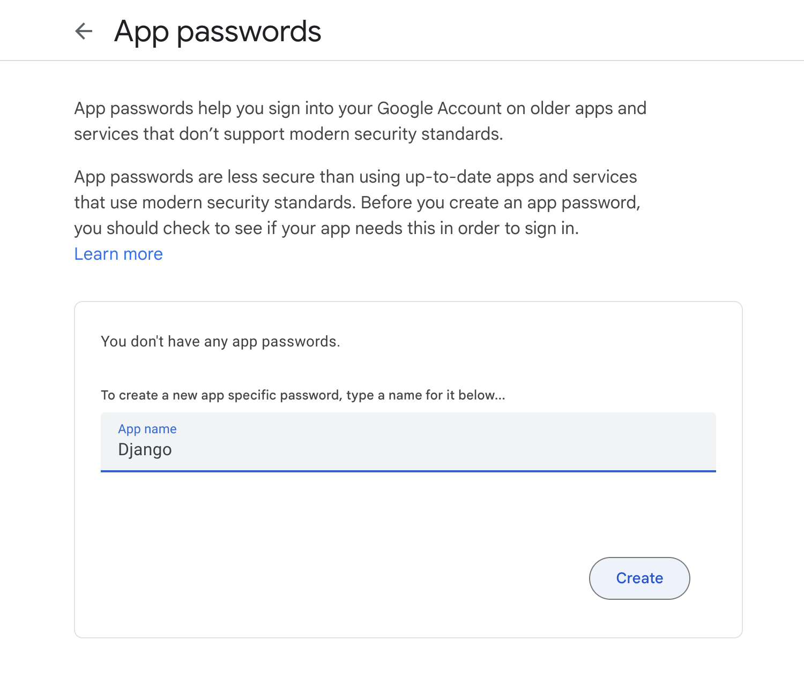
    <br> Copy the password
    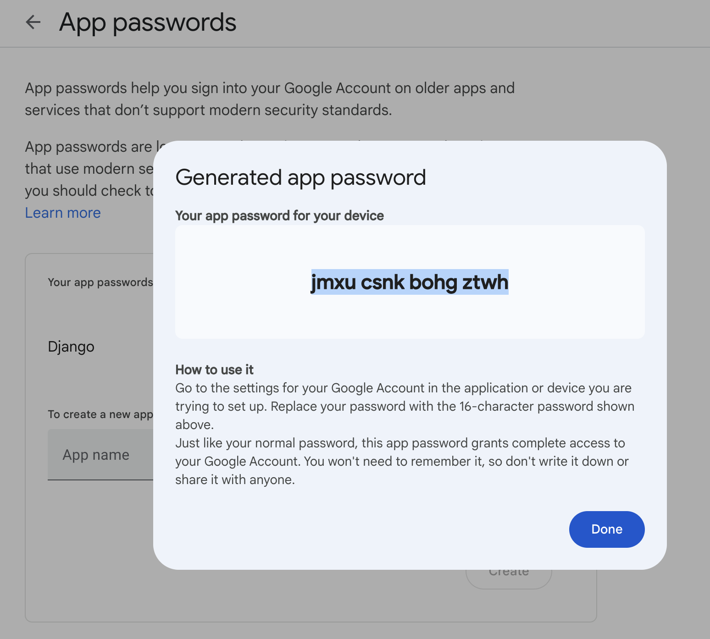

    <br>

2. Now, whatever machine you might be using, just set these two environment variables: `EMAIL_USER` & `EMAIL_PASS` as your gmail address and the app password you copied earlier.
These two variables will be picked up by the Django app at runtime.

    For more details check this [guide](https://chlee.co/how-to-setup-environment-variables-for-windows-mac-and-linux/) on how to add environment variables.

Feel free to explore alternate options for sending emails like [django-anymail](https://github.com/anymail/django-anymail)

---
---

## Introduction
A Graphical Password Authentication system is an authentication system that uses some combination of graphical images replacing the regular passwords. Graphical passwords may offer better security than text-based passwords because most of the people use regular, popular passwords everywhere and are prone to social engineering attacks. So graphical passwords can put stop to many attacks of this kind.

<br>

## Resistance to Popular Attacks
### Bruteforce
After reaching max tries, the user will be notified via message through email. And the further authentication through the generic URL/website is disabled for that user account, instead, they have to use the link that will be sent by the company in the notification email. This also lets the legitimate user know about the adversary. 

### Shoulder Surfing
Shoulder surfing is a type of social engineering technique used to obtain information such as personal identification numbers (PINs), passwords and other confidential data by looking over the victim's shoulder. The system we adopt is similar to the Phone pattern system. The pattern is invisible on the screen when the users draw it. This makes it incredibly tough for the adversary to see the images on the grid that the user clicks.

### Spyware
Graphical password systems resist spyware more easily than regular passwords. Key-loggers secretly capture keystrokes and transfer, but if the spyware wants to track the mouse movements, it can be tracked, but the adversary wouldn’t know which part of the mouse event is actually the graphical password. The timeline vs mouse-event graph is too difficult to get the pattern

### Hidden Camera
There will be a camera in front of the user which identifies a face while authentication i.e., the number of pixels the face occupies should be 80-90% of the total pixels in the current frame and if this condition is not satisfied then the screen does not show the graphical password. It alerts the user to cover the screen with a proper posture. But this will be a costly operation. 

### Phishing
Since the adversary is made to believe that the password is a set of images, it’s not possible to make a fake page, since the adversary thinks he doesn’t know the images. Moreover, we restrict the user to one attempt and suggest the user to give a fake password every time so that he triggers the server to send and URL in email so that he can log in through the legitimate login page, and the adversary cannot send the URL to users from a legitimate server. However, when the adversary knows the technique this attack might be still possible. 

<br>

## Screenshots
Welcome Page
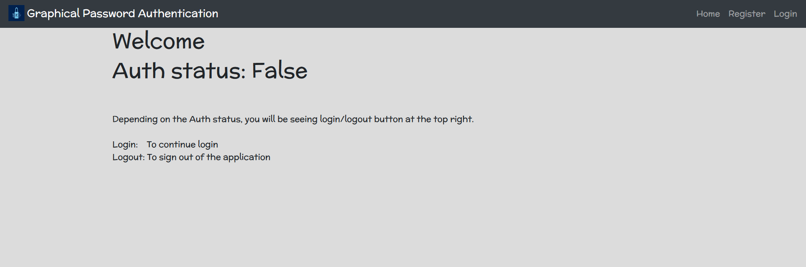
<br> <br>
Sign Up Page
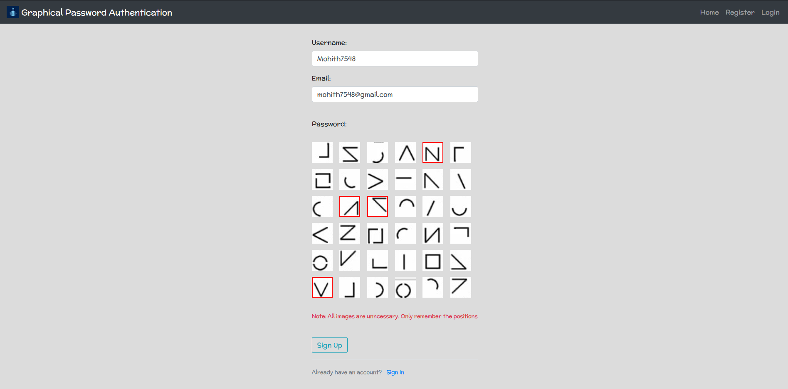
<br>
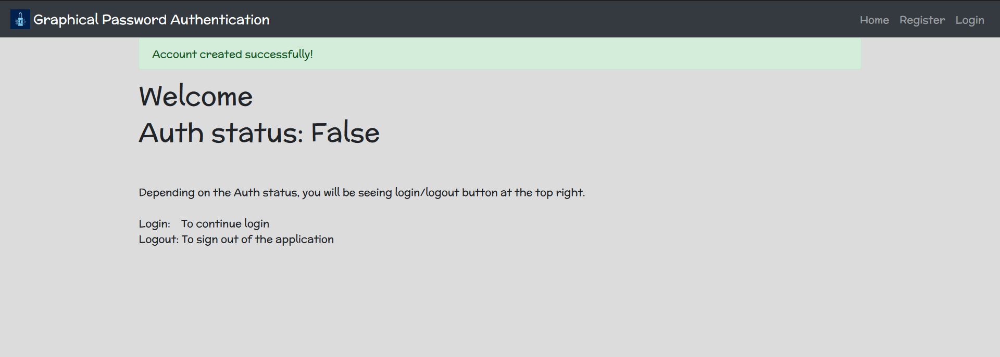
<br>
After logging in
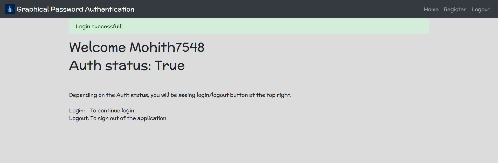
<br> <br>
Password Reset Page
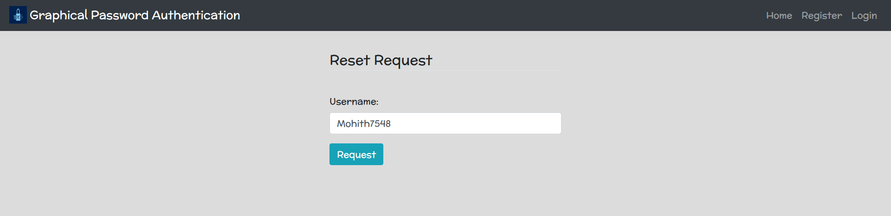
<br>
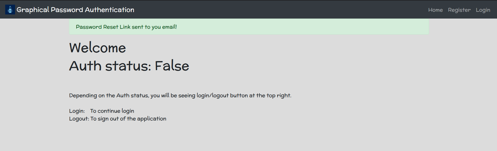
<br>
Mail received with password reset link
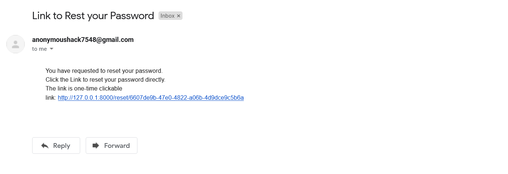
<br>
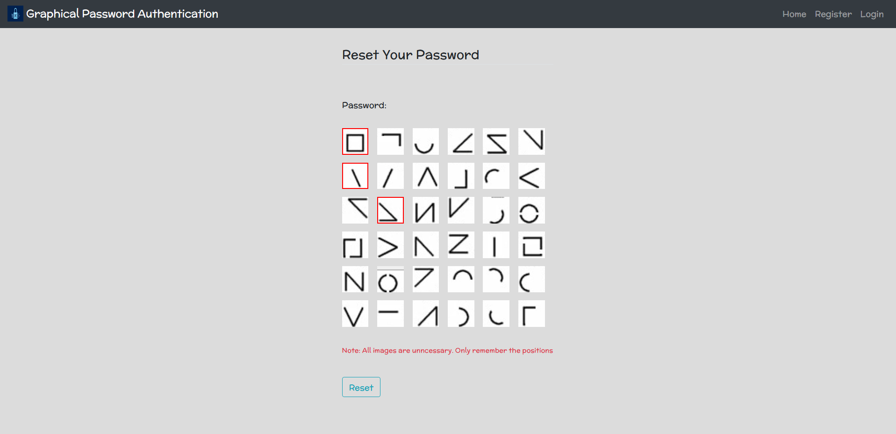
<br> <br>
Account blocked due to multiple Failed attempts
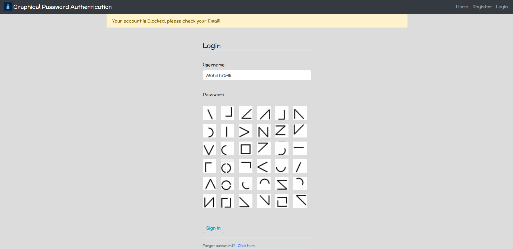
<br> Notification mail received of Account blockage
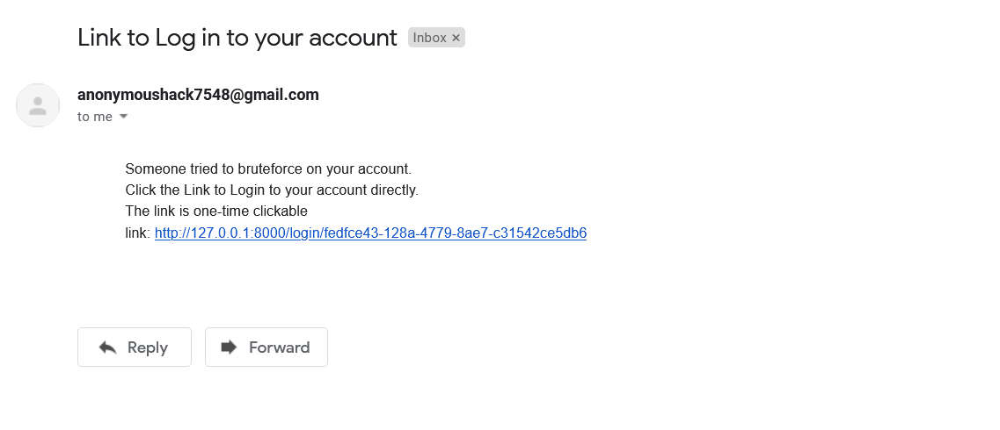

<br>

#### Thank you

